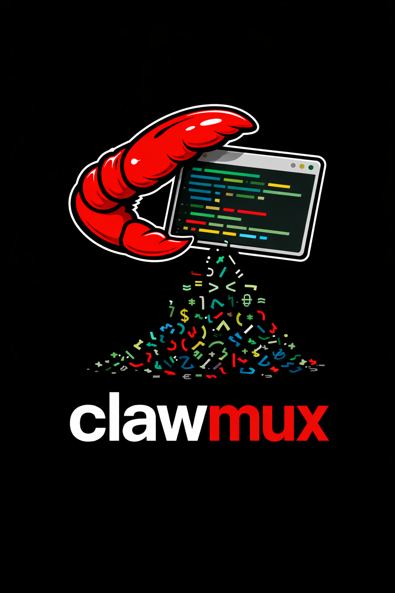

# ClawMux

<p align="center">
  
</p>

ClawMux is a GenAI coding assistance multiplexer and task orchestrator. It manages scrum-style stories and tasks, assigns them to a sequential pipeline of AI agents powered by [opencode](https://opencode.ai), and provides a unified TUI for interacting with those agents.

## Features

- **Scrum-style task management**: Stories and tasks loaded from markdown files
- **7-agent sequential pipeline**: Intake -> Design -> Planning -> Implementation -> Code Quality -> Security Review -> Code Review
- **Human-in-the-loop**: Questions, approval gates, and code review with inline comments
- **Unified TUI**: Left pane task navigation + 4-tab right pane (details, activity, team status, review)
- **Multi-provider LLM support**: Works with any provider supported by opencode (Anthropic, OpenAI, Google, etc.)

## Project Status

**18 of 26 implementation tasks completed. 206 tests passing.**

### What works today

- `clawmux init` -- full interactive wizard: checks for the `opencode` binary, configures LLM provider credentials, scaffolds the project directory, and generates agent definition files
- TUI -- terminal UI renders with left-pane task list navigation and Tab 1 (task details view)
- Task markdown parsing and writing -- round-trip fidelity for all task file sections
- OpenCode HTTP client -- session creation, SSE event streaming, server lifecycle management (auto-start/reuse)
- kiro-cli -- ACP (agent control protocol) integration to use kiro-cli as a backend.
- Workflow state machine -- pure state transition logic for all 7 agents and human-in-the-loop gates

## Getting Started

### Prerequisites

- Rust (stable toolchain)
- An API key for a supported LLM provider

### Installation

```bash
cargo install --path .
```

### Project Initialization

Run the interactive setup command once per project:

```bash
clawmux init
```

To regenerate agent definitions from built-in defaults:

```bash
clawmux init --reset-agents
```

### Running

```bash
clawmux
```

## Task File Format

Tasks are markdown files in the `tasks/` (or `docs/tasks/`) directory:

```markdown
Story: 1. Big Story
Task: 1.1 First Task
Status: OPEN
Assigned To: [Intake Agent]

## Description

<description of the task>

## Starting Prompt

<optional starting prompt>

## Questions

Q1 [Intake Agent]: What language do you want to use?
A1: Rust

## Design

<design considerations>

## Implementation Plan

<implementation plan>

## Work Log

1 2026-02-10T10:00:01 [Design Agent] Updated task with design.
```

## Architecture

ClawMux acts as a client to an `opencode serve` HTTP server or `kiro-cli` via agent-control-protocol (ACP). See `docs/design.md` for the full architecture documentation.

## Module Structure

```
src/
├── main.rs              -- CLI entry point (clap), initializes logging
├── app.rs               -- Top-level App struct, async runtime and event loop
├── config/              -- Config file I/O, `init` wizard, provider definitions
│   ├── mod.rs
│   ├── init.rs
│   └── providers.rs
├── error.rs             -- Unified ClawMuxError type
├── messages.rs          -- Internal message bus types (AppMessage enum)
├── opencode/            -- HTTP client for the opencode server
│   ├── mod.rs
│   ├── server.rs        -- Server lifecycle: auto-start, health check, reuse
│   ├── session.rs       -- Session creation and management
│   ├── events.rs        -- SSE event streaming and parsing
│   └── types.rs         -- API request/response types
├── tasks/               -- Task file parsing, models, and writing
│   ├── mod.rs
│   ├── models.rs        -- Task, Story, Status, Agent enums
│   ├── parser.rs        -- Markdown -> Task round-trip parser
│   └── writer.rs        -- Task -> Markdown serializer
├── tui/                 -- Ratatui terminal UI
│   ├── mod.rs
│   ├── layout.rs        -- Pane layout definitions
│   ├── task_list.rs     -- Left-pane task list widget
│   └── tabs/            -- Right-pane tab views
│       ├── task_details.rs
│       ├── agent_activity.rs
│       ├── team_status.rs
│       └── code_review.rs
└── workflow/            -- Agent pipeline state machine
    ├── mod.rs
    ├── agents.rs        -- Agent definitions and capabilities
    ├── transitions.rs   -- State transition logic
    └── prompt_composer.rs -- Task-to-prompt construction
```


```bash
cargo run
```
